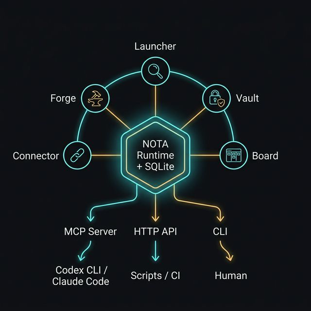

# Entrance

**你的 AI 编程助手的「操作系统」。**

*The "operating system" for your AI coding agents.*

> 如果 Codex CLI 是一个干活的工人，Entrance 就是他的工具箱 + 记忆宫殿 + 保险柜。
> 工人下班了再上班，打开 Entrance，上次做到哪、密钥在哪、下一步该干嘛 —— 全都还在。

---

## 一图看懂 / Architecture



---

## 装完能干嘛？三个真实场景 / Real Examples

### 场景 1：给 Codex CLI 装上「记忆」

你用 Codex CLI 重构了一半代码，关掉终端。第二天打开，Codex 什么都不记得了。

用 Entrance：

```powershell
# Entrance 作为 MCP server 启动，Codex CLI 连上它
.\entrance.exe mcp stdio

# Codex 现在能读到昨天的进度、决策记录、待办事项
# 不用你再复述一遍 "昨天我们改到哪了"
```

*Codex CLI forgets everything after you close the terminal. Entrance gives it persistent memory via MCP.*

### 场景 2：不再到处翻 API Key

OpenAI key 在 `.env`，Anthropic key 在另一个 `.env`，Linear token 在浏览器里……

用 Entrance：

```powershell
# 所有 key 加密存在一个地方，agent 按需取用
.\entrance.exe nota status
# → token_count: 5, mcp_config_count: 3
```

*All API keys encrypted in one place. Agents fetch them on demand through Vault.*

### 场景 3：一条命令派活、全程监管

你想让 agent 去修一个 bug，但想知道它在干嘛、干完没、结果怎么样。

```powershell
# 派发任务
.\entrance.exe nota do --title "修复登录页 500 错误"

# 查看进度
.\entrance.exe nota overview

# 验收完毕，存个档
.\entrance.exe nota checkpoint --stable-level "login-fix-done" \
  --landed "修复了 auth middleware 的空指针"  \
  --remaining "需要补集成测试"  \
  --human-continuity-bus "下次从测试开始"
```

*Dispatch a task, monitor progress, save a checkpoint — all from the CLI.*

---

## 快速开始 / Quick Start

### 下载即用

1. 从 [Releases](https://github.com/myteapot/Entrance/releases) 下载最新 Windows zip
2. 解压，运行 `entrance.exe`
3. 试一下：`.\entrance.exe nota status`

### 接入 AI Agent

```powershell
# 让 Codex CLI / Claude Code 通过 MCP 连接 Entrance
.\entrance.exe mcp stdio

# 或者用 HTTP（适合脚本和 CI）
.\entrance.exe mcp http --port 9720
```

### 从源码构建

```powershell
pnpm install --frozen-lockfile && pnpm build
cargo build --manifest-path src-tauri/Cargo.toml --release
```

---

## 五个插件，各管一摊 / Plugins

| 插件 Plugin | 类比 Analogy | 状态 |
|---|---|---|
| **Launcher** | Spotlight / Raycast —— 全局快捷键搜索启动 | ✅ |
| **Forge** | 工头 —— 派活、盯梢、收工 | ✅ |
| **Vault** | 保险柜 —— API key 加密存取 | ✅ |
| **Board** | 看板 —— 对接 Linear 的任务面板 | 🚧 |
| **Connector** | 插线板 —— 打通 Obsidian / Slack / 任意服务 | 🚧 |

---

## 技术栈 / Tech Stack

Rust · Tauri 2 · SolidJS · SQLite · TOML · MCP

---

## 当前阶段 / Status

**V0 Headless Alpha** — 运行时、CLI、MCP Server 可用，GUI 开发中。

---

## 许可 / License

[Business Source License 1.1](./LICENSE) · [详情 LICENSES.md](./LICENSES.md) · [商标 TRADEMARKS.md](./TRADEMARKS.md)
